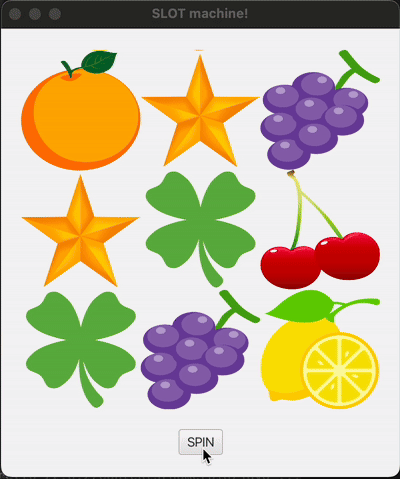

# Java FX slot machine App

## Introduction
This Slot Machine application in JavaFX was created to help students practice working with canvas, texture loading, animations, and algorithm design. It features a graphical interface where users can interact with the slot machine, 
spin the reels, and see the results with smooth animations. The project utilizes JavaFX's Canvas API for rendering, loads textures dynamically for the symbols, and uses animations to simulate reel spinning. Additionally, it incorporates 
a random outcome algorithm to ensure fair game results. 

## Discalimer
This topic was chosen at the request of one of my students, although I do not identify with or support gambling. This project offers a hands-on opportunity to explore JavaFX while enhancing skills in graphics, animation, and algorithm development.

## App thumbnail

